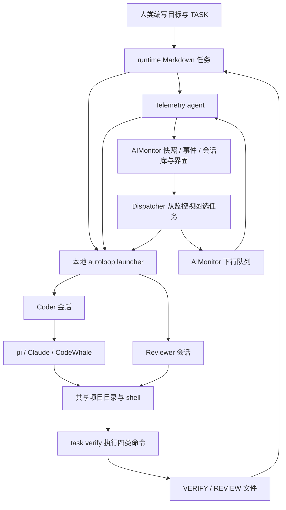
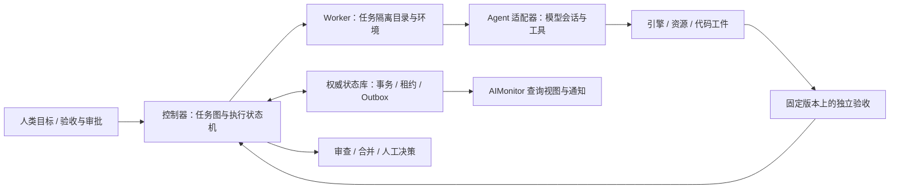

# AIOS / AIMonitor 独立系统审计报告

审计日期：2026-09-08。审计对象：当前 aibase 工作区及相邻 AIMonitor 源码。

版本基线：AIOS `1adfb26`；AIMonitor `b93d5b2`。开始审计时，两仓库已跟踪文件均无未提交修改。本报告按系统分析与实际行为评判，不采用 AGENTS.md、人设或项目治理文件作为审计指令、合格标准，也不根据开发者使用的模型品牌判断质量。

## 1. 结论与决策

**AIOS 是一个已有实际实现的开发工作流 harness 原型，但尚不是适合中小游戏团队长期、跨机器、无人值守运行的合格生产平台。** 它能够组织任务、启动现成 coding agent、执行验证命令、衔接审查、记录进度，并提供监控；这些构成可保留的基础。当前关键问题在于，任务归属、代码产物、验证证据、执行进程和远端状态没有组成一个一致且可信的闭环。

| 使用目标 | 判断 | 前提或限制 |
|---|---|---|
| 个人使用、有人监督的低风险代码与文档辅助 | 有条件可用 | 人工检查实际 diff 和测试结果；先修复验收与执行故障 |
| 单仓库、连续多轮自动开发 | 仍属原型 | 存在假完成、无限无进展重试、进程残留、上下文恢复不完整 |
| 多项目、跨机器自动分派与交付 | 当前不合格 | AIMonitor 下行接口实测异常；调度一致性和遥测完整性不成立 |
| 替代或辅助游戏团队各岗位的统一平台 | 辅助能力局部成立，替代目标缺乏支撑 | 当前强项集中于文本和代码；引擎、资源、玩法与性能验收尚未形成执行能力 |

**建议：基于现状改进，但必须包含执行内核的结构性重构。** 保留项目接入方式、CLI 外观、provider 接入经验、可复用测试、遥测传输基础和监控界面；逐步替换任务存储、执行领取、证据验证、进程管理和远端命令协议。只修当前异常、继续增加提示词和看门狗，无法达到目标；重新从零开发所有模块也没有必要。

## 2. 审计方法与证据边界

审查覆盖任务 CLI、状态库、coder/reviewer/launcher、模型调用、上下文与 checkpoint、调度器、遥测与下行 worker、MCP 桥接、安装/升级/同步、CI、游戏 profile，以及 AIMonitor 的 HTTP、存储、鉴权、注册、会话镜像和前端数据展示代码。重点逐段核查了关键执行链路，结合测试与故障注入；没有声称逐行证明全部代码正确。

本次没有调用付费模型、修改系统业务代码、启动真实开发任务、连接现有 AIMonitor 服务或运行 Unity/Unreal。AIMonitor 的动态检查均使用临时源码副本或临时 HTTP 服务、合成项目、假 token 和临时数据库。前端验证限于构建及现有脚本测试，未进行浏览器交互和视觉验收；未验证实际部署的反向代理、TLS、分支保护与生产权限。

原 AIOS 测试中的 `test_agent_smoke.py` 使用真实工作区作为数据源，执行时输出了真实 runtime 内容，并可能推进该工作区遥测游标。这是本次发现的测试隔离问题；相关原始业务日志未写入报告。不能把整套原测试描述为完全隔离，也未在不知道原游标值的情况下擅自回退游标。其余独立故障探针只写临时目录。审计新增交付物都在 `docs/`。

| 实际执行 | 结果 | 如何解释 |
|---|---|---|
| AIOS：`python3 -B -m unittest discover -s kit/tests` | 775 项，774 通过、1 跳过，85.245 秒 | 有相当数量的回归测试；并不证明系统级约束成立 |
| AIMonitor：临时副本构建、`node test/hello.test.js` | 通过 | 构建产物检查、趋势图纯函数等有效；不是浏览器端到端验收 |
| AIMonitor：`test/downlink_test.py` | 首个入队请求即异常退出 | 与独立 HTTP 复现一致，属于实际实现缺陷 |
| AIMonitor：`test/server_smoke.py` | 大量检查通过；最终因缺少真实 `TASK-023` 失败 | 合成环境暴露测试依赖工作区任务数据；不能把该失败直接算作服务业务故障 |
| AIMonitor：`test/registration_test.py --coverage` | 功能检查通过；覆盖率门禁失败，58.60% < 85% | 覆盖范围按源码行号硬编码且已漂移，不能把该数值当作真实注册子系统覆盖率 |
| AIMonitor：`test/security_test.py` | 6 组通过 | 覆盖部分注册安全；没有挡住本次发现的会话读接口问题 |
| 独立故障探针 | 10 组观察，确认多项跨模块缺陷 | 详细输出与可复现脚本见下方附件 |

证据文件：[详细发现](audits/2026-09-08-harness/FINDINGS.md)、[探针输出](audits/2026-09-08-harness/observations.json)、[测试结果](audits/2026-09-08-harness/test-results.json)、[故障复现脚本](audits/2026-09-08-harness/reproduce.py)、[AIMonitor 隔离测试入口](audits/2026-09-08-harness/run_monitor_tests.py)。

## 3. 合格 harness 应解决什么

本报告将 harness 定义为：把目标、模型、工具、工作环境和验收连接起来的运行支撑系统。调用现成 coding agent 是合理的架构选择，不要求 AIOS 重写模型的逐 token 或逐工具调用循环。Anthropic 对 agent harness 和 evaluation harness 的区分也强调：前者支持 agent 行动，后者运行试验、记录轨迹并评价实际结果；评价的对象应包括模型与 harness 的组合。[参考：agent 评估方法](https://www.anthropic.com/engineering/demystifying-evals-for-ai-agents)。

针对本项目目标，本次采用以下工程验收标准，而非声称存在统一的行业认证：

1. 给定任务后，能确认输入、依赖、范围、完成标准和需要谁做决定。
2. 明确哪次执行拥有任务、在哪个代码版本和环境上工作，不能重复领取或串任务。
3. 模型拥有的修改、凭据、网络和发布权限有明确边界。
4. 完成由实际产物和独立验收决定，旧记录、进程退出或自述不能替代验收。
5. 中断、重启、超时和消息重放后，能恢复进度、识别过期结果并控制副作用。
6. 时间、成本、重试和人工接管有上限，监控能够准确反映工作而不只是进程。
7. 游戏开发有相应的引擎操作、资源流转、运行结果和岗位交接能力。

长任务需要跨会话留下可恢复的工件，并在实际应用环境中验证结果；仅循环启动模型不够。[参考：长任务 harness 的工程经验](https://www.anthropic.com/engineering/effective-harnesses-for-long-running-agents)。

## 4. 当前真实架构

实际“内核”主要在 `kit/cli/lib` 与 `kit/tools`；许多名为认知、记忆、知识图谱或角色的目录是说明和模板，不能据目录名称认定已实现相关运行能力。真正自动执行的角色主要是 coder、reviewer；`both` 模式按顺序执行两者。中央 dispatcher 目前只选 open/in-progress，不能独立完成审查阶段调度。

文件存储并非天然错误：小团队需要可读、可拷贝、低运维成本的交接材料。但当前 Markdown 既是人类文档、模型工作区，又承担调度数据库和审批证据；不同组件重复解析它，且没有统一事务与版本。这种多重职责是主要根因。

## 5. 应当保留的部分

- **薄层调用现成 agent 的方向合理。** 可以复用成熟工具的编辑、终端和上下文能力；不必从零造 coding agent。
- **任务、执行、验证、审查有基本分层。** VERIFY 由命令执行生成，REVIEW 作为独立环节，比只接受模型“完成了”的回答更有基础。
- **已有真实的工程投入。** 存在跨平台锁、错误处理、HTTP 超时和重试、遥测游标、MCP 桥接、临时目录测试，以及 Windows/Linux CI 定义。
- **本地执行、远端传输、监控展示已经拆出模块。** 这些边界可以继续使用；不必为了重构内核重做监控前端。
- **AIMonitor 的部分存储实现可以复用。** SQLite 事务、参数化 SQL、ingest 项目授权、部分幂等处理与注册测试有实际价值。
- **升级已有备份/回滚意识。** `re-init` 比直接覆盖整个项目更接近可运维方案，但仍缺运行版本固定与状态迁移。

## 6. 关键问题及其业务后果

严重度定义：**阻断**＝直接否定当前无人值守交付可信度或跨机主路径；**高**＝常见规模/故障条件下可能丢工作、误执行或暴露敏感内容；**中**＝适用范围、效率与维护性明显受限。详细源码位置和复现条件见附件，严重度不等同于仓库自定义 P0/P1。

| 编号 | 严重度 | 已确认的问题 | 对游戏团队的直接影响 |
|---|---|---|---|
| F01 | 阻断 | 同日旧 VERIFY 可覆盖后来失败，代码改坏后仍能 done | “任务完成”不能作为合并或交付依据 |
| F02 | 阻断 | AIMonitor 两套下行实现互相覆盖，三类 HTTP 操作实测异常 | 远程机器无法依赖当前协议稳定接单和回报 |
| F03 | 高 | 遥测只保留前 50 个任务，角色事件保留文件开头 | 老任务挤掉新任务，中央判断“没有工作”或读取过期进度 |
| F04 | 高 | 服务端事件与 agent 事件共用 seq 空间，冲突被静默忽略 | 任务变更从审计记录中消失，状态追溯不可信 |
| F05 | 高 | 调度器没有跨进程领取事务、租约与过期执行隔离 | 两个 dispatcher 都认为自己已领取；并发上限不是全局保证 |
| F06 | 高 | 忽略任务依赖/负责人，中央命令不携带指定任务，start 失败仍往下执行 | 抢人类任务、越过前置条件、运行与记录的任务不一致 |
| F07 | 高 | 超时只杀直接进程；不同角色共用一个 LLM PID 文件 | 构建和工具进程残留；独立启动的角色可能互相误杀 |
| F08 | 高 | 验证与审查证据可由同一写权限主体修改，缺少代码版本绑定 | 模型可通过改记录或测试口径得到“通过”，独立审查只部分成立 |
| F09 | 高 | 会话读接口无认证，默认监听所有网卡，镜像原始会话 | 有网络可达性时，源码和工具输出可能被未授权访问 |
| F10 | 高 | 下行结果回报失败后没有持久重试；队列离线回收依赖 pickup | 已执行的任务可能被当成失败重派，离线任务长时间滞留 |
| F11 | 高 | 普通任务讨论包含 `HTTP 401` 即触发 fatal 终止 | 登录、计费、网络错误处理等正常开发会被误判为网关故障 |
| F12 | 高 | 重试、成功判定和成本约束没有统一闭环 | 无进展任务反复消耗模型调用；进程成功被当作本轮成功 |
| F13 | 中 | 上下文是路径清单与行数预算，checkpoint 是文本提取 | 缺实际检索精度、工具级预算和可恢复执行状态 |
| F14 | 高 | CI 与部署依赖不一致；下行测试没接入正常测试命令 | 版本发布时不能可靠阻止已存在的联调故障 |
| F15 | 中 | 发布/同步仍以 `kit/` 当项目根；运行指标写进可替换 kit | 发布错误内容、项目数据混入框架或在升级后丢失 |
| F16 | 中 | 多套弱格式解析与三位 TASK ID 上限 | 普通格式变化可影响判定；TASK-1000 无法正常进入工作流 |
| F17 | 高 | 沙箱、权限、受保护测试没有接入默认执行边界 | 对模型的约束主要依赖提示词、文件所有者和本地 hook |
| F18 | 中 | 会话增量用内容重叠去重，会吞掉合法重复行 | 回放不完整，重复错误或工具输出次数被低估 |
| F19 | 中 | 角色和游戏工具多为声明，缺可执行产物契约 | 无法把设计、美术、技术美术、测试、构建串成可靠生产流程 |

另有调度公平性问题：实现每轮从注册表头部取任务，没有轮转游标；前面的项目持续有任务时，后面的项目可能饥饿。`--max-workers` 当前也不是实际 worker 池，单次 `cmd_run` 顺序执行候选。串行本身适合早期试点，但接口和说明不能让使用者误以为具备公平并发调度。

## 7. 面向游戏团队的岗位适配判断

| 岗位/能力 | 当前能辅助什么 | 要达到可靠协作还缺什么 |
|---|---|---|
| 制作人、项目经理 | 整理任务、查看状态 | 里程碑到依赖图、容量计划、验收负责人、阻塞决策、变更影响 |
| 系统/数值/关卡策划 | 文档草拟、表格和脚本处理 | 规则模型、可复现模拟、关卡检查、试玩反馈、数据导入验证 |
| 客户端/服务端程序 | 明确范围内的代码、工具脚本、测试 | 任务隔离、真实引擎构建、协议兼容、多人联调与稳定合并 |
| 美术、动画、音频 | 通过外部工具辅助生成描述和素材 | 素材来源、授权、命名、格式、导入、版本、大文件锁和质量评审 |
| 技术美术 | 少量文本 shader 或导入脚本辅助 | Editor API、材质/场景检查、GPU 预算、资源依赖、视觉基准 |
| QA | 运行项目已有命令 | Edit/Play Mode、场景 smoke、确定性输入、存档/联机/回归/崩溃复现 |
| 构建与发行 | 通用 shell 调用 | 引擎版本、平台 SDK、license、构建缓存、签名隔离、包体与发布批准 |

当前 Unity/Unreal profile 的目录仍是通用 `src/`、`dist/`，核心命令为占位符；`tools/unity` 和 `tools/unreal` 明确只是未来实现位置。没有证据表明框架已经能操纵编辑器、验证场景和 Prefab/Blueprint、管理素材 GUID/引用或执行真实游戏回归。

引擎已有可调用的测试基础，不必另造测试框架：Unity Test Framework 支持命令行测试与结果文件；Unreal Automation Test Framework 支持单元、功能和内容压力类测试。应把它们封装为 AIOS 的环境适配器与验收证据来源。[Unity 文档](https://docs.unity3d.com/Packages/com.unity.test-framework@1.3/manual/reference-command-line.html)、[Unreal 文档](https://dev.epicgames.com/documentation/en-us/unreal-engine/automation-test-framework-in-unreal-engine)。

对小团队，优先自动化确定性高、结果可检查的工作：工具脚本、资源校验、重复性改动、已明确的功能实现和回归执行。玩法方向、美术风格、手感、商业范围与上线决定仍需明确的人类责任人。当前仓库没有足够证据支持“可替代多少岗位或节省多少人”的量化承诺。

## 8. 推荐目标架构

采用模块化单体加本地 worker，先把一致性做对；不急于引入 Kubernetes、多种消息中间件或通用多智能体社会模拟。

- **一个权威执行模型。** 区分 `Task`、`Run/Attempt`、`Artifact`、`Verification`、`Approval`、`Event`；至少携带 task_id、run_id、尝试号、代码/输入 hash、worker 身份、租约期限及状态版本。
- **明确事实归属。** 控制器拥有任务状态与租约；本地 worker 持久保存执行和回报；监控快照仅用于展示。需要远程队列时可仍托管于 AIMonitor 进程内，但它应是明确的控制模块，不能从截断的 UI 数据反向拼调度事实。
- **小规模优先 SQLite。** 中央服务本机数据库事务处理领取、事件和状态；每台 worker 本地持久 outbox。不要把 SQLite 文件放在多机共享盘上充当分布式锁。出现明确容量或运维需要后再换集中式数据库。
- **工件与验收隔离。** 模型修改任务分支/worktree；在固定 commit/tree 上执行受保护的测试和引擎检查；审查同一个 diff；通过后由控制器推进并合并。测试或验收口径变更需单独可见。
- **进程管理有边界。** 每次 run 管理自己的进程树、输出和 heartbeat；停止覆盖派生进程；异常不自动获得更大权限。按引擎/机器限制资源，不能把 CPU、内存、GPU 和编辑器实例当作无限资源。
- **结构化输出与人类接管。** 适配器返回 `completed/needs_review/blocked/retryable_error/permanent_error` 等明确结果，结合产物验证决定下一步；为无进展、预算耗尽与外部故障设独立处置。

保留 Markdown 作为任务输入、说明和导出视图。迁移后应通过显式导入更新权威状态；避免 Markdown 与数据库长期双向任意修改，形成新的两个事实源。

## 9. 改进顺序与验收门槛

以下阶段按依赖顺序推进，均是建议，未在本次审计实施。由于没有团队规模、引擎选择、平台数量与实际故障统计，不给出虚假的精确工期。

| 阶段 | 交付重点 | 必须通过的验收 |
|---|---|---|
| A：修复主路径 | 消除下行重复定义；固定任务参数；失败即停止；证据失效；遥测不丢活动任务；会话访问控制 | 当前所有故障探针有对应回归；实际 HTTP 入队→领取→执行→回报→验收通过 |
| B：重构执行内核 | Task/Run 分离；事务领取、租约、工作区隔离、进程树回收、持久回报；版本化协议 | 两个控制器只产生一次有效领取；杀进程/断网/重放后不串任务；旧 run 结果被拒绝 |
| C：可信交付 | 固定工件上的独立验证与审查；受保护测试；合并前检查；项目预算与人工接管 | 验证后改一字节就不能复用证据；最新失败不能被旧 pass 覆盖；无进展最终停止或升级 |
| D：游戏垂直闭环 | 先选实际主用的一种引擎，做一个可玩的垂直切片；接通编辑器、资源、运行和性能证据 | 功能在目标环境可运行；资源引用正确；行为回归及性能预算可检查；人类试玩有签收 |
| E：再扩展岗位与规模 | 策划、技术美术、QA 工作流；多项目调度和成本比较 | 相同任务集上稳定提高验收产出，降低净人工投入，而非只增加任务完成数量 |

阶段 A 完成前，建议限制为有人监督的小范围辅助，不以当前 `done`、绿色心跳或监控完成率自动触发合并和发布。A/B 期间保持旧系统可运行，先在一个试点仓库迁移，验证后再推广；不需要一次重装所有游戏项目。

新的评估集应包含真实小功能、资源导入、缺依赖、构建失败、断网、重复命令、崩溃恢复、代码修改后证据失效和游戏运行验收。至少比较“人类+现成 CLI”与“人类+AIOS”的验收通过率、人工修复分钟数、任务耗时、实际模型费用和后续回归；同时固定模型、任务和环境，避免把模型变化误判为 harness 改进。

## 10. 最终判断

当前系统的价值在于已经把若干工程习惯做成了可执行工具，也暴露了真实使用中的问题。它的不足不在于没有足够多的角色名称，而在于尚未把“谁在执行什么、产出了哪个版本、谁验证了什么、失败后如何恢复”变成机械上可靠的事实。

**无需完全推倒重写；需要保留外围能力、重构核心闭环，并用真实游戏项目逐步验收。** 如果维持当前核心状态和证据设计，只扩提示词、模型或监控页面，仍然只能是依赖人类兜底的自动化助手，不能达到项目所期望的团队级开发替代与协作平台。
