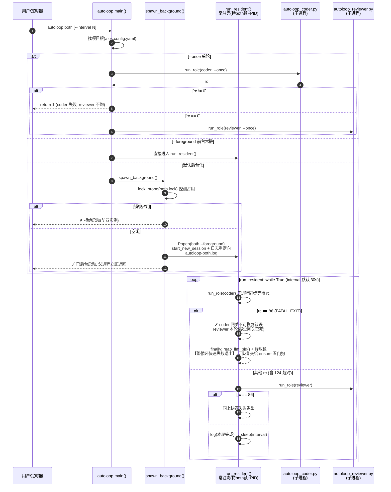
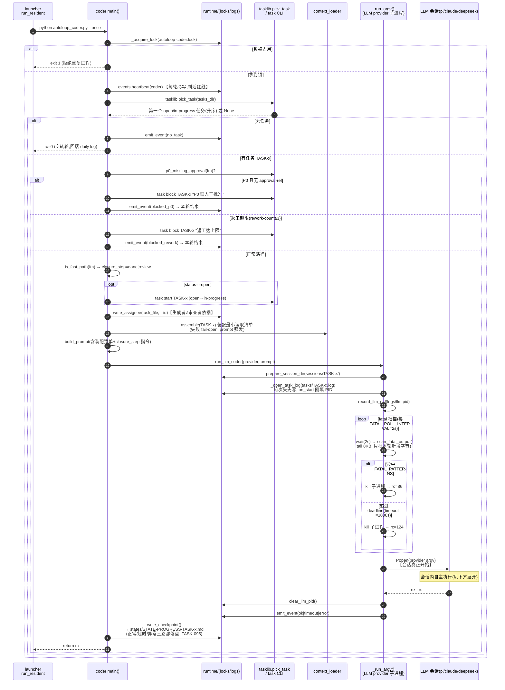
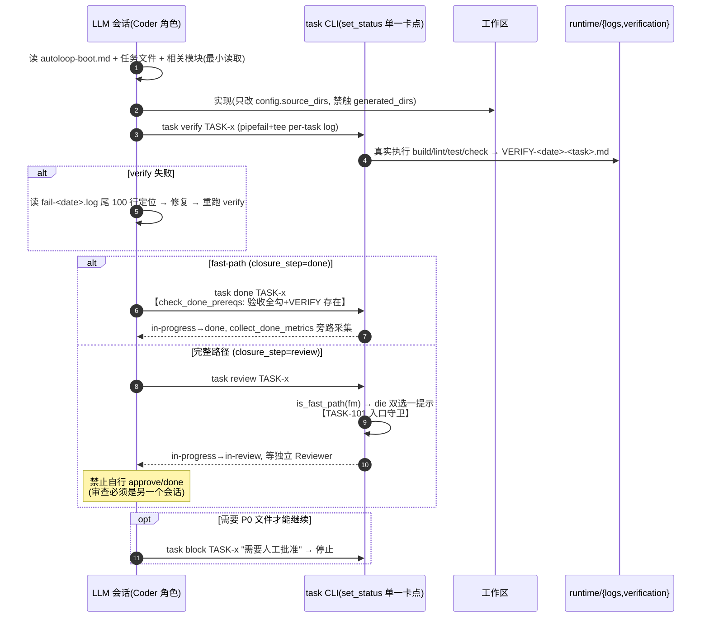
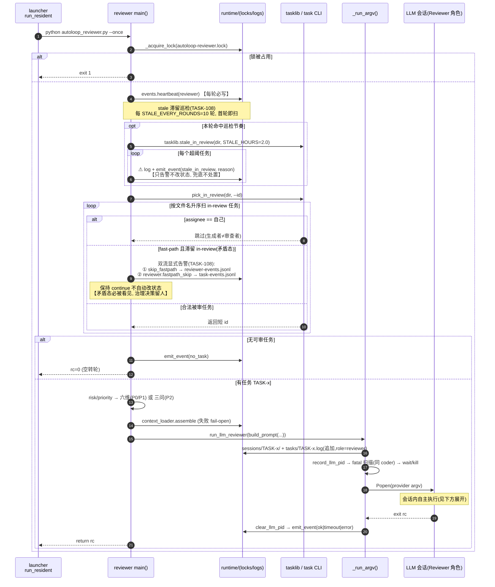
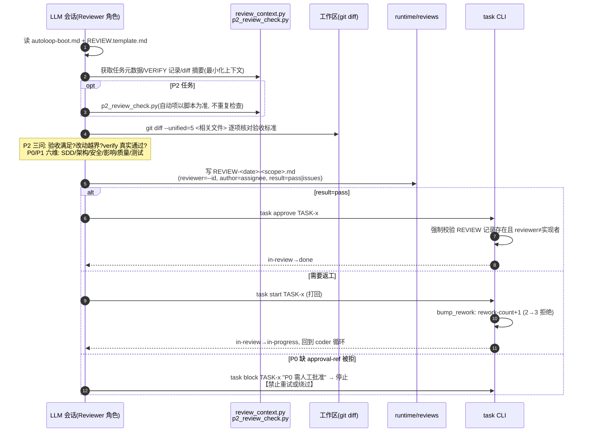

# autoloop coder/reviewer 时序图（单源全景）

> **文档定位**：autoloop 三层（launcher / coder / reviewer）与 task CLI 状态机、LLM provider
> 的交互时序单源文档。事故复盘与新人上手直接引用本文，不再逐文件重读代码。
>
> **代码锚点**：行为以文档生成时工作区代码为准（含 ensure 看门狗自愈、
> fast-path 不可绕过不变量、stale 滞留巡检）。所有图内交互均标注函数名，图-码可对照；
> 各特性演进溯源见源仓任务卷宗（机制表中 TASK-xxx 锚点）与 git log。
>
> 相关文档：`kit/cli/README.md`（用法与看门狗配方）、`kit/cli/autoloop-boot.md`（会话内速查）、
> `kit/docs/ARCHITECTURE.md`（整体架构）。

## 0. 参与者与全局约定

| 参与者 | 代码位置 | 职责 |
|--------|----------|------|
| **launcher** | `kit/cli/lib/autoloop_launcher.py`（857 行） | 模式分发（coder/reviewer/both/stop/status/ensure）、常驻循环调度、子进程编排、看门狗 |
| **coder 核心** | `kit/cli/lib/autoloop_coder.py`（698 行） | 选任务→拦截检查→起 LLM 会话实现→checkpoint |
| **reviewer 核心** | `kit/cli/lib/autoloop_reviewer.py`（337 行） | 滞留巡检→选 in-review→起 LLM 会话审查 |
| **task CLI** | `kit/cli/task` + `lib/tasklib.py` | 状态机单一卡点（`set_status`）、verify/done/approve 前置检查 |
| **LLM provider** | pi / claude / deepseek（`lib/llm.py`） | 真正干活的会话，退出码契约见下 |
| **文件系统** | `runtime/{locks,logs,tasks,states,verification,reviews}` | 锁、心跳、事件、断点、VERIFY/REVIEW 记录 |

**退出码契约**（`lib/llm.py:31-33`，全链路统一）：

| 码 | 常量 | 含义 | 后续动作 |
|----|------|------|----------|
| 0 | — | 会话正常结束 | 记 `ok` 事件 |
| 124 | `TIMEOUT_EXIT` | 超过 `--timeout`（默认 1800s）被 kill | 记 `timeout` 事件，**循环继续下一轮** |
| 127 | `EXIT_NOT_FOUND` | provider 可执行文件不存在 | 记 `error` 事件 |
| 86 | `FATAL_EXIT` | 输出命中 `FATAL_PATTERNS`（欠费/401/403 等网关不可恢复错误） | 记 `error` 事件；**both 常驻立即整体退出**（快速失败） |

**并发与活性**（TASK-012/015/099/107 逐层加固）：

| 机制 | 文件 | 说明 |
|------|------|------|
| 进程锁 ×3 | `runtime/locks/autoloop-{both,coder,reviewer}.lock` | fcntl/msvcrt 非阻塞排他，进程死 OS 自动释放；重复启动拒绝（exit 1） |
| PID 文件 | `runtime/locks/autoloop-both.pid` | 常驻壳 PID，ensure 探活用 |
| LLM 子进程 PID | `runtime/logs/llm.pid`（`record_llm_pid`/`reap_llm_pid`） | 孤儿收编：壳退出时 SIGTERM 在跑的 LLM 子进程 |
| 心跳 ×2 | `runtime/logs/autoloop-{coder,reviewer}.heartbeat` | 每轮 `run_once` 开始写 mtime；ensure 判活依据 |
| 事件流 | `runtime/logs/autoloop-{coder,reviewer}-events.jsonl` | ok/timeout/error/no_task/blocked_p0/blocked_rework/skip_fastpath/stale_in_review |
| 审计流 | `runtime/logs/task-events.jsonl` | task 状态流转 + TASK-108 新增 `reviewer.fastpath_skip` |
| 会话日志 | `runtime/logs/tasks/<TASK-ID>.log`（人读摘要）+ `runtime/logs/sessions/<TASK-ID>/`（pi 全量回放） | per-task 追加 + 轮次头回填 PID（TASK-100/103） |

---

## 1. 总览：both 常驻调度（launcher 层）



**要点**：
- `run_role()`（launcher:268）以 `subprocess.run([python, autoloop_<role>.py, --once])` 同步
  运行角色核心；并发唯一权威是**角色核心内层锁**，launcher 不另加锁。
- coder fatal（86）时 **reviewer 跳过**——网关已死，跑了也白跑（run_resident:349 注释语义）。
- 常驻壳收到 SIGINT/SIGTERM → `_stop_handler` 抛 KeyboardInterrupt → finally 收编 LLM
  孤儿子进程 + 释放锁（TASK-099）。

---

## 2. coder 单轮时序（autoloop_coder.run_once）



**LLM 会话内部展开**（prompt 指令即 `build_prompt`（coder:529）的执行，会话是普通 agent，
读 AGENTS.md 进治理框架）：



---

## 3. reviewer 单轮时序（autoloop_reviewer.run_once）



**LLM 会话内部展开**（prompt 即 `build_prompt`（reviewer:211）的执行）：



---

## 4. 失败与自愈时序（TASK-107）

```mermaid
sequenceDiagram
    autonumber
    participant T as 外部定时器<br/>(systemd/cron 每2min)
    participant E as autoloop ensure<br/>cmd_ensure()
    participant FS as runtime/{locks,logs}
    participant RES as run_resident 常驻壳
    participant LP as LLM 子进程

    Note over T,E: ensure 是幂等命令非常驻进程:<br/>健康 no-op; 死了拉起; 僵了换血
    T->>E: python3 kit/cli/autoloop ensure
    E->>FS: 读 autoloop-both.pid + 两角色心跳 mtime
    E->>E: ensure_decision(pid_alive, hb_age,<br/>threshold=2×interval+timeout≈1860s)
    alt PID 死/缺失 (如真实事故实录: 循环 exit 86 全退)
        E->>E: spawn: 后台拉起 both 常驻<br/>(锁已随进程死亡由 OS 释放)
    else 壳在但最新心跳停滞 > 阈值
        E->>RES: SIGTERM(触发 daemon 收尾)
        RES->>LP: reap_llm_pid() 收编在跑的 LLM 孤儿
        RES->>FS: 释放 both 锁 → 退出
        E->>E: restart: 拉起新实例<br/>(否则内层锁拒新实例=永远拉不起来)
    else 健康(或进程太新无心跳, 防误杀)
        E-->>T: noop, exit 0
    end
    Note over E: 返回码: 0=健康或已拉起; 1=拉起失败<br/>(并发锁竞争属预期, 定时器可忽略)
```

**三种典型故障的走向**（对照真实事故：某仓 coder 会话 verify 收尾撞轮次超时被杀，
exit 86 快速失败后无看门狗接管，任务孤儿 12 小时才被人工发现）：

| 故障 | 时序走向 | 兜底 |
|------|----------|------|
| 会话超时（rc=124） | `_run_argv` 杀子进程 → `timeout` 事件 → checkpoint 落盘 → **循环继续下一轮** | 自身即恢复 |
| 网关不可恢复（rc=86） | fatal 扫描（2s 粒度，只扫本轮新增字节）提前 kill → both 循环**整体快速失败退出** | **ensure 看门狗拉起**（无定时器/看门狗进程则永久停摆——真实事故孤儿 12h 的根因；TASK-111 补本仓自看薄壳 `autoloop watchdog`） |
| 壳僵死（如卡满 timeout） | 心跳停滞 > 1860s | ensure **restart** 分支换血 |

> ⚠ 已知边界：若网关错误持续性存在（欠费/403），ensure 会形成"每 2 分钟 spawn→die"
> 的有界抖动。可接受：每次失败均记 `error` 事件（监控端可计数告警），勿调小
> `--max-age` 去"省"重试。

---

## 5. 附：与 task CLI 状态机的交接点汇总

| 交接点 | 发起方 | 状态转换 | 前置检查（`tasklib.set_status` 单一卡点） |
|--------|--------|----------|------------------------------------------|
| `task start` | coder（open→开工）/ reviewer（打回） | open→in-progress；in-review→in-progress（+bump_rework，≥3 拒绝） | 返工上限 |
| `task block` | coder（P0/返工超限）/ reviewer（P0 缺批准） | 当前→blocked | — |
| `task verify` | LLM coder 会话 | 不转状态，写 VERIFY 记录 | 真实执行 build/lint/test/check |
| `task done` | LLM coder 会话（fast-path） | in-progress→done | check_done_prereqs：验收全勾 + VERIFY 存在；P0 需 approval-ref；fast-path 无需 REVIEW |
| `task review` | LLM coder 会话（完整路径） | in-progress→in-review | **is_fast_path → die**（TASK-101 入口守卫 + TASK-108 set_status 不变量，任何入口不可绕过）；reviewer 心跳不在岗则醒目告警（--wake 可唤醒） |
| `task approve` | LLM reviewer 会话 | in-review→done | 强制 REVIEW 记录存在且 reviewer≠实现者 |
| `task stale` | reviewer 循环内巡检（TASK-108） | 不转状态 | in-review 超 2h 逐条告警 |

**状态机图示**（对话视角）：

```
coder 侧:  open ──start──▶ in-progress ──verify+done(fast-path)──▶ done
                              │    └─verify+review(完整路径)─▶ in-review ─┐
reviewer 侧:                  │                                          ├─approve─▶ done
                              ◀──────────start(打回, rework+1)───────────┘
                              ▼ blocked（P0/返工超限，等人工）
```

---

*行为变更时同步更新本图（图内交互均带函数锚点，diff 代码即可 diff 图；特性溯源锚点指向源仓任务卷宗与 git log）。*
